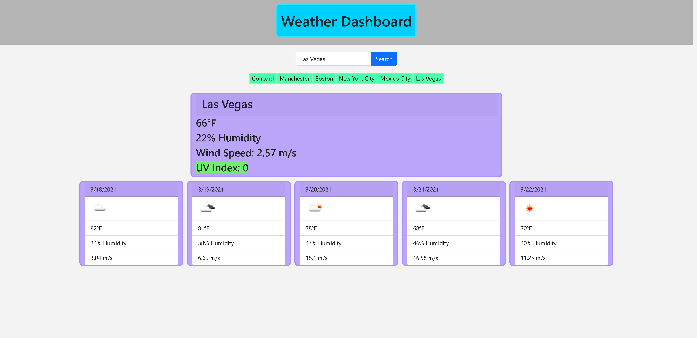

# Weather-Dashboard

 ## Description 
 This is a weather application allowing you to lookup the current weather in your city. After typing in a city and clicking search, you are presented with all the usual weather data.
 When the page loads you are shown temperature, humidity, wind speed, and the UV Index. Also shown is a five day forecast of what weather is ahead. After searching a city, you can click on one of your recent searches to view that data agin without having to type it in!

 # Preview
 Here is what the page looks like with saved cities: 


 ## Getting Started:
The page is live at https://scottgeleas.github.io/Weather-Dashboard/.

 ## Prerequisites:
If you want to edit this web page you must have a Github account,    
and have also downloaded Visual Studio Code.

- Create a Github account here: [Github](https://github.com/)
- Download Visual Studio here: [Visual Studio](https://code.visualstudio.com/download/)
- Repository link: [Weather Dashboard](https://github.com/scottgeleas/Weather-Dashboard)

 ### Authors:
```
 Scott Geleas
```

 ### Built With:
```
- Open Weather API
- HTML
- CSS
- Javascript
- jQuery
- Bootstrap
- Visual Studio Code
```

 ### Acknowledgments:
```
University of New Hampshire Coding Bootcamp
```

 ### License: 
 ```
MIT License

Copyright (c) [2021] [Scott Geleas]]

Permission is hereby granted, free of charge, to any person obtaining a copy
of this software and associated documentation files (the "Software"), to deal
in the Software without restriction, including without limitation the rights
to use, copy, modify, merge, publish, distribute, sublicense, and/or sell
copies of the Software, and to permit persons to whom the Software is
furnished to do so, subject to the following conditions:

The above copyright notice and this permission notice shall be included in all
copies or substantial portions of the Software.

THE SOFTWARE IS PROVIDED "AS IS", WITHOUT WARRANTY OF ANY KIND, EXPRESS OR
IMPLIED, INCLUDING BUT NOT LIMITED TO THE WARRANTIES OF MERCHANTABILITY,
FITNESS FOR A PARTICULAR PURPOSE AND NONINFRINGEMENT. IN NO EVENT SHALL THE
AUTHORS OR COPYRIGHT HOLDERS BE LIABLE FOR ANY CLAIM, DAMAGES OR OTHER
LIABILITY, WHETHER IN AN ACTION OF CONTRACT, TORT OR OTHERWISE, ARISING FROM,
OUT OF OR IN CONNECTION WITH THE SOFTWARE OR THE USE OR OTHER DEALINGS IN THE
SOFTWARE.
```